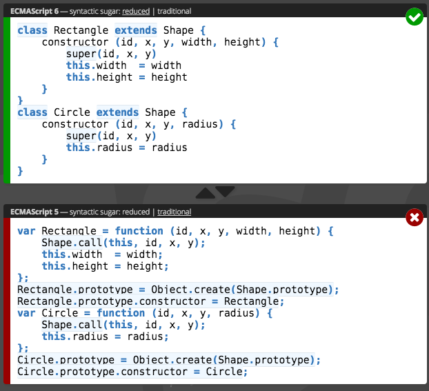
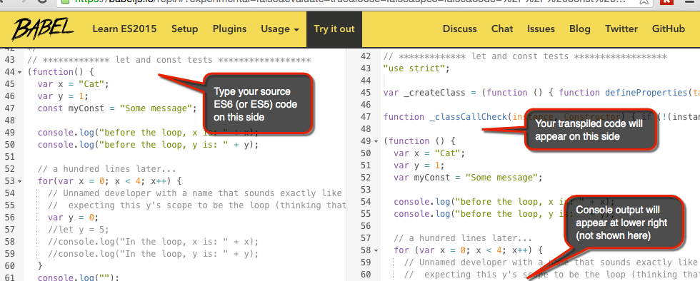

#ES6 JavaScript

ES6 (or ES2015) is the latest standard version of JavaScript.  More specifically, ECMAScript (ES) is the language *specification* for JavaScript implementations.

We are seeing the JavaScript community using ES6, and much of the *React* community in particular seems to favor using it over the older ES5.  And from my experience using ES6 and reading other people's ES6 code, it is a welcome update.

Overall I think ES6 makes JavaScript coding *easier* and *safer* to write and understand.  And I think the learning curve is fairly low. 


## Learning Resources

### Preface

#### What to learn first
I would categorize ES6's main additions as: 
1. Syntax additions
2. New methods on native objects (like Array, String, and Math).

When you're first learning ES6, I think a good first goal is to be able to understand other people's ES6 code.  With that goal in mind, I recommend starting with the new *syntax* additions.  In contrast, the new *methods* will syntactically look the same, and will thus not trip you up - you can just look up what they do when you get to them.

#### Tips that I've not seen well-explained

Before you start working your way through the resources list below, there are a few points that I think will help you if you're first learning these new features.  These are not full explanations about these features, but rather things to augment the descriptions you'll see in the other resources.

1. **Destructuring**:  Just realize that anytime you see `{` and `}` on the LEFT HAND SIDE of the assignment operator (`=`), that the syntax means you are “destructuring”- *not* creating an object.  If you see something wrapped in the curly braces on the RIGHT HAND SIDE of the assignment operator, it mean you’re making an object.

 Destructuring can also work with **arrays**, so the same principle applies to seeing `[` and `]`.  Left-hand-side means its destructuring, right-hand-side means you’re making an array.

2.  **Arrow functions**:  Sometimes people just show these as being a less-verbose way to write anonymous functions.  That’s great and all, but a **big benefit** to them is also the fact that it **automatically binds the “this” of its context**.  Here’s an example:

 ```
// Note: using ES6 Class syntax here since it is much more understandable
class TestClass {
        constructor() {
            this.x = 5;
            this.y = 6;
        }
  
        doSomething() {
            console.log("before setTimeout, x: " + this.x);
            
            // Using an ES5 function... problem child
            setTimeout(function() {  
                console.log("In the setTimeout, without arrow func, x: " + this.x);
            }, 100); // Would have to add ".bind(this)" to the end of 
                     //  the anonymous function to get it to work
            
            // ES6 arrow function: this one works great without having
            //  to do anything about “this” (it gets bound automatically!)
            setTimeout(
              // this is an "arrow function"
              () => { 
                console.log("In the setTimeout, WITH arrow func, x: " + this.x); 
              }, 100
            );
        }
}
var testClass = new TestClass();
testClass.doSomething();
```
Output:
 <p class="code-output">
 before setTimeout, x: 5 <br />
 In the setTimeout, without arrow func, <strong>x: undefined</strong> <br />
 In the setTimeout, WITH arrow func,  <strong>x: 5</strong> <br />
 </p>
 <br />
3. **Classes**:  Its best to [compare](http://es6-features.org/#ClassInheritance) how a class would have to be written in ES5 compared to its ES6 equivalent to appreciate the advancement.  Unfortunately, many tutorials don’t show the ES5 equivalent since it is often quite large and ugly.  The ES5 examples you’ll want to look at are ones that show how you have to add things onto the prototype of the “class” that you’re defining (ES5 does not use the "class" keyword).

 Here is an example.  The top part is ES6, the bottom is the equivalent ES5.

 


### Resources list

1. **[ECMAScript 6 (ES6): What’s New In The Next Version Of JavaScript](http://www.smashingmagazine.com/2015/10/es6-whats-new-next-version-javascript/)** by Lars Kappert (Smashing Magazine): This article talks about features in a to-the-point manner - focusing mostly on examples.  As stated in the preface above, I would skip over the sections that talk about new methods on the String, Math, and Array objects for now.  
2. **[Top 10 ES6 Features Every Busy JavaScript Developer Must Know](http://webapplog.com/es6/)** by Webapplog: This one complements the Smashing Magazine article above because it talks about a few different features than what that one does. 
3. **[ECMASCript 6 - New Features: Overview & Comparison](http://es6-features.org/#Constants)**:  One of the biggest ways to appreciate what ES6 gives you is to compare how it compares to the equivalent ES5 code.  That's what this resource excels at!  In fact, it provides not much of anything else.  Thus its not a great place to *start* your learning (since it does not try to explain things).  But is a great resource once you are ready to *compare* the two versions.
5. [**Exploring ES6**](http://exploringjs.com/es6/index.html) by Dr. Axel Rauschmayer:  This is a full ebook.  Its probably not the best place to start your learning. But if you want a larger reference or more-detailed explanations, this looks like a good source.  The author seems to be well-respected in the industry.

### Try out ES6 coding online

<p class="todo-note">
<strong>TODO</strong>... Show the Babel "try it out" page with an <a href="{{ book.linkBabelEditorBlockScopeExample }}">example of block scope</a>
</p>

Now that you've read about ES6 features, its time to try them out!  Babel has a very handy [online transpiler]({{ book.linkBabelEditorBlockScopeExample }}) that you can use to learn ES6!  See your code transpiled as you type:

[]({{ book.linkBabelEditorBlockScopeExample }})
