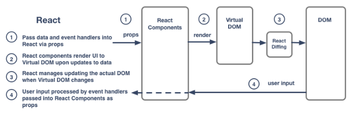

# Getting stared learning React

Here are some resources that I think will be helpful if you're starting at ground zero:

1. [**React for Everyone**](https://www.youtube.com/playlist?list=PLLnpHn493BHFfs3Uj5tvx17mXk4B4ws4p) - video series by LevelUpTuts.  He starts you out assuming you know nothing about React, just explaining core React concepts (not *why*, but *how*).  Then by video #7 he starts using a starter kit to build an application.  At that point he's using the React Router and passing data between components in a non-contrived way.

2. [Todo...]