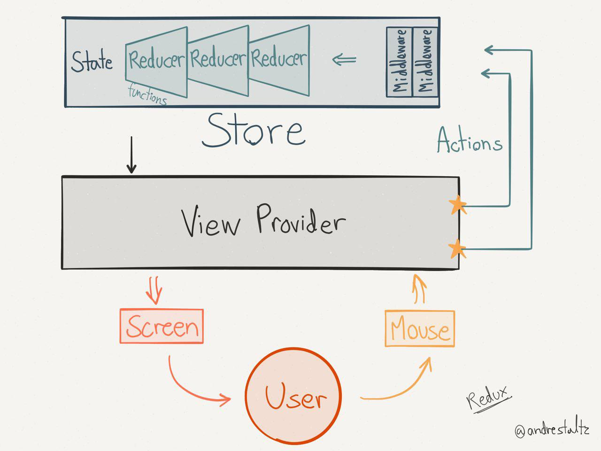

# Learn React

## Introduction
There are two main parts of the React ecosystem to learn:
1. The **React** library
2. A **Flux** implementation

**React** is the library that lets you write components for your UI.  If you're brand-new to React, head over to the [Getting Started](./Getting-Started/README.md) sub-chapter.

##A quick note about Flux/Redux
If you're just getting started learning React, you don't need to get bogged down right now trying to learn Flux or Redux.  However, I'm mentioning it here to give you sense of where you'll end up.  And this may help you to begin to understand React's place in the data-flow of the entire application.  With that said, here's a quick intro.

**Flux** is an architectural pattern that works especially well with React to handle data flow on the client.  For our Flux implementation, we are using the **Redux** library.  I have an entire chapter dedicated to Redux, so I won't get into it too much yet.  The main thing to understand about Redux at this point is that:
1. **It lets us avoid tightly coupling our React components**.  As you'll see when you get to the Redux chapter, the React components don't need to know as much about each other when they can simply fire Redux "actions" and other React components can receive modified data from the Redux "store".  
2. Peices of your Redux code will usually **request and receive data from the server**. 

### Data Flow with Redux and React
For now, you can think of the data flow in the following diagram without the Actions and Store parts (**React** would be our "View Provider"):

Putting React back in the mix now, the data flow looks something like this.  Don't worry if you don't understand what "Virtual DOM" and "React Diffing" mean yet.

