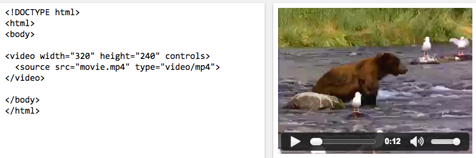

# React

## What is React?
React is a library built by Facebook for building UIs with ***components***.  The idea with components is that implementation details can be abstracted away into manageable chunks that can be more-easily reasoned about.  Additionally *composing* these abstractions becomes a powerful programming tool.

Quick aside: you'll soon learn that in the React community the term "reason about" must be used at least 12 times in any documentation in order for it to gain acceptance.  😎

Consider the following example with the `<video>` element:

Notice how we don't have a bunch of `
` elements with a bunch of attributes for things like `data-bind="some-binding: {something: someObservable() != something()}"`.  Instead, we have just `<video>`.  This is the elegance and power of components.

