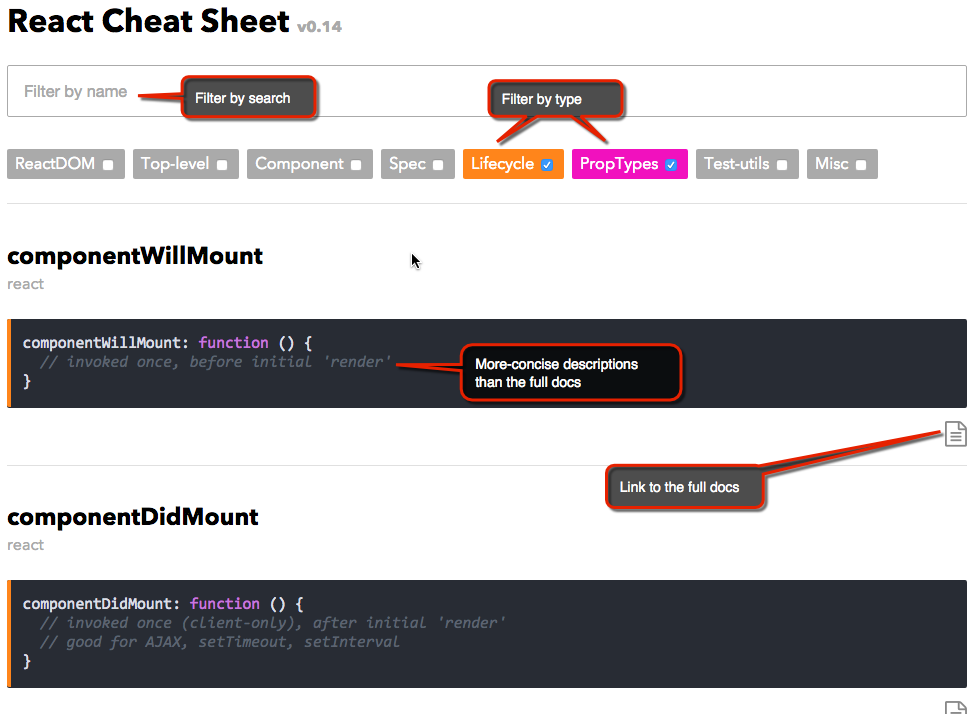

# React References

1. [**React Cheatsheet**](http://chantastic.github.io/react-cheat-sheet/):

 
 
 This reference is handy for finding React methods and things quickly and seeing a concise description about them. 
 
2. 