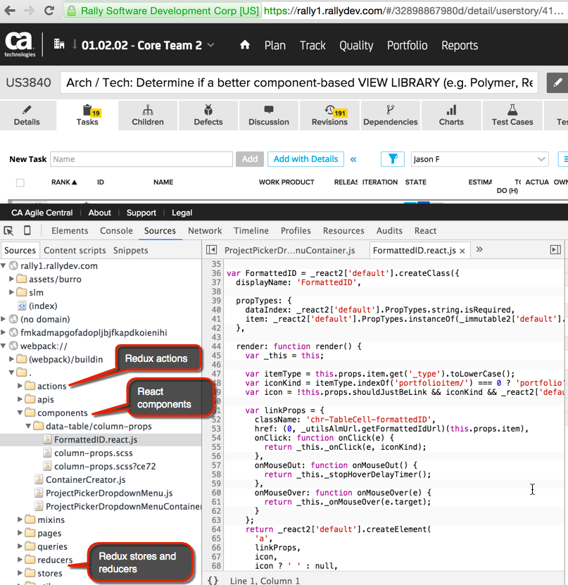

#Who's using React?
In this chapter, you'll learn about other companies that are using React, as well as [why they decided to use it](./why-companies-use-react.md).

**Facebook**, the creator of React, [eats their own dog food](http://www.reactnative.com/a-closer-look-of-how-react-native-is-used-at-facebook/).  **Instagram** (owned by Facebook), not surprisingly also uses React.  React is used in production by many other companies you know.  

According to [this video](https://youtu.be/Q6Kczrgw6ic?t=504), its used by **Netflix**, **Twitter**, **Apple**, and **AirBnB**:

The list does not end there. Others [include](https://github.com/facebook/react/wiki/Sites-Using-React):
* Atlassian (makers of HipChat)
* BBC
* Dailymotion
* Dropbox
* Imgur
* Intuit
* Khan Academy
* Mapbox
* Paypal
* Rally (CA Technologies)
* Reddit
* Salesforce
* The New York Times
* Uber
* WhatsApp
* Wired
* Wordpress.com
* Yahoo

Perhaps one of the most notable companies for the G2 team to note that is now using React and Redux is... **Rally** (or CA technologies as they are now known).  They are a good example of an enterprise application that is heavily focused on data using the React ecosystem at scale.

