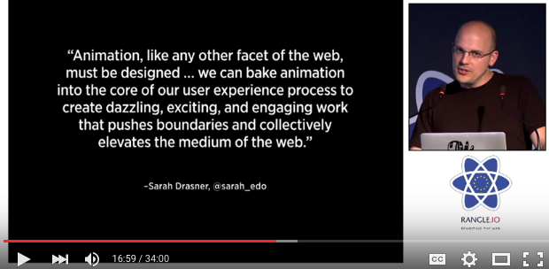

#React Router

[This video](https://www.youtube.com/watch?v=Q6Kczrgw6ic) shows (among other things):

1. Some simple how-to (early part)
2. The importance of URLs (at ~4:30)
3. Animated transitions between pages (at 16:00)
4. Cooperation with server-side rendering (at 19:20)
5. Dynamic routing, gradual loading and more (starting at 20:15)

