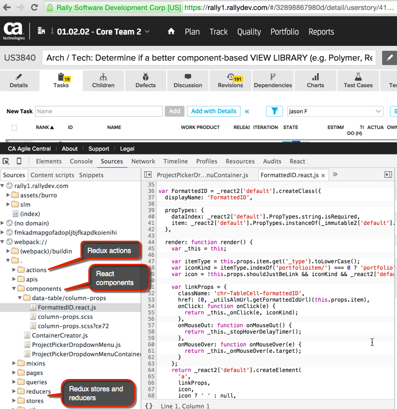

#Who's using React?
In this chapter, you'll learn about other companies that are using React, as well as why they decided to use it.

**Facebook**, the creator of React, [eats their own dog food](http://www.reactnative.com/a-closer-look-of-how-react-native-is-used-at-facebook/).  **Instagram** (owned by Facebook), not surpisingly also uses React.  React is used in production by many other companies you know.  

According to [this video](https://youtu.be/Q6Kczrgw6ic?t=504), its used by **Netflix**, **Twitter**, **Apple**, and **AirBnB**:

The list does not end there. Others [include](https://github.com/facebook/react/wiki/Sites-Using-React):
* Atlassian (makers of HipChat)
* BBC
* Dailymotion
* Dropbox
* Imgur
* Intuit
* Khan Academy
* Mapbox
* Paypal
* Reddit
* Salesforce
* Uber
* WhatsApp
* Wired
* Wordpress.com
* Yahoo

Perhaps one of the most notable companies for the G2 team to note that is now using React and Redux is... **Rally** (or CA technologies as they are now known).  They are a good example of an enterprise application that is heavily focused on data using the React ecosystem at scale.

##Why do big-name companies use React?

http://reactkungfu.com/2015/07/big-names-using-react-js/

**Netflix** [likes React](http://techblog.netflix.com/2015/01/netflix-likes-react.html) because of its performance, scalability, and compositional design patterns.

When **Yahoo mail** [revamped their front-end](http://yahooeng.tumblr.com/post/101682875656/evolving-yahoo-mail), they wanted:
* Predictable flow ~ Easy Debugging
* Independently deployable components
* Shorter learning curve 
* No dependency on large platform libraries

They evaluated Ember.js, Angular.js, Knockout.js, Durandal, Rivets, and React. They chose React. They said that it "felt like a good solution to make debugging and understand data flows much easier and predictable". 

**Atlassian**, makers of Jira, BitBucket, and HipChat, also considered Angular and Ember. They [chose React](https://developer.atlassian.com/blog/2015/02/rebuilding-hipchat-with-react/) because they believed it had several advantages.  A few they cited include:
* Its focus on **Components**: they cited being able to share code with native clients (desktop apps, mobile apps)
* React's **Virtual DOM** speed
* **Simplicity**: "The public API can be memorized in a day and once you've built your first component, it's easy to build the next one with confidence that it'll just work."
* **Unidirectional data flow**: "The benefit of this is that you know exactly where your data is mutating, making it easier to test and maintain your app."
* **Testability**: "React components simplify testing greatly. As a proof of it's simplicity, our new web client has more tests than any of our other clients."
* 

