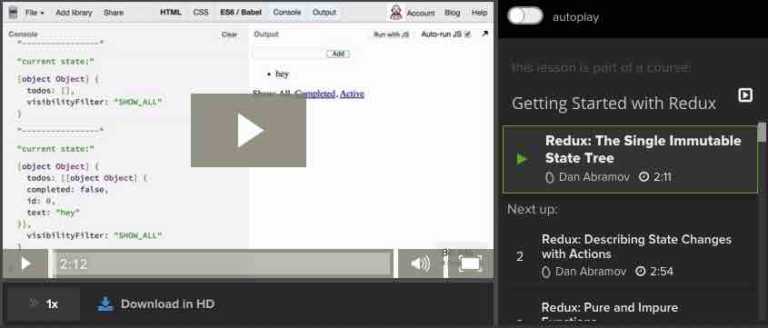
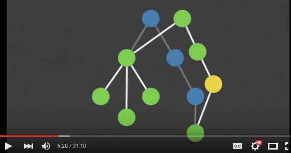

# Getting started with Redux

1. A Cartoon Intro to Redux by Lin Clark has two main purposes.  First, it shows Redux differs from Facebook's Flux library.  I don't recommend spending too much time trying to understand that aspect of it, but it does at least start to give you a feel for Redux concepts. Second, it breaks down the pieces and data flow of Redux into office-cartoons that really help hammer-home the concepts.  **I recommend reading this now and then *again* after you've read/watched the next resources which show code**.  After you've seen the code, rereading this will help to crystallize how everything works together.

2. Now for a resource that actually teaches you how Redux works and how to use it in an application.  [**Getting started with Redux**](https://egghead.io/series/getting-started-with-redux) is a video series of 30 short videos by Dan Abramov, creator of Redux.  In this series he explains both the concepts of Redux and how to implement the pieces.  It is very down to earth and easy to follow.  Along the way, he shows a few benefits of ES6 (but that’s not the focus).  If you only have a very limited amount of time, you could watch just the first 4 videos (totaling about 8 minutes) to get a sense of both what Redux is like and the quality of this resource.  

  

3. The [**official Redux documentation**](http://rackt.org/redux/index.html) is excellent. If nothing else, you should check out the [Basics section](http://rackt.org/redux/docs/basics/index.html), which is a good written counterpart to the 30-video series mentioned above (it creates a Todo app).
  

3. [**Immutable Data and React**](https://www.youtube.com/watch?v=I7IdS-PbEgI) from React.js Conf 2015.  As you'll learn in the other resources for Redux, immutability is a key component to Redux.  When we first presented Redux to our architecture team, they had questions about the **memory usage** and about **how the change-detection works**.  These are 2 key aspects of using immutable data.  

 

 This video shows:
     1. How **memory usage** can be efficient (via “structural sharing”)
     2. How **change-detection** becomes:
        1. very *easy* to check for (just comparing the reference of the “before” and “after”), and,
        2. extremely *fast* (O(1)). 
   
 
 Note that the *implementation* of immutability in this video uses the Immutable.js library – but that is just one way to go about this.  (Recall that Dan Abromav shows doing without that library in his Egghead videos.)  So the *implementation* that he shows is not the important part here – the 2 key aspects mentioned above are.  

 
 G2 Note: as of December 2015, we have not determined whether or not we will use the Immutable.js library.
