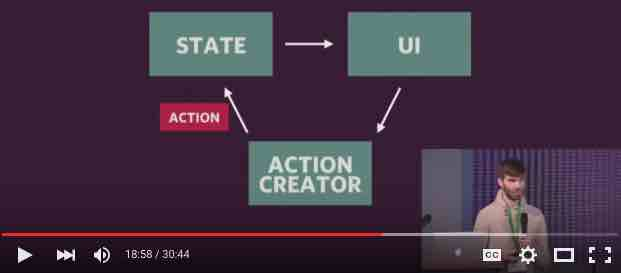
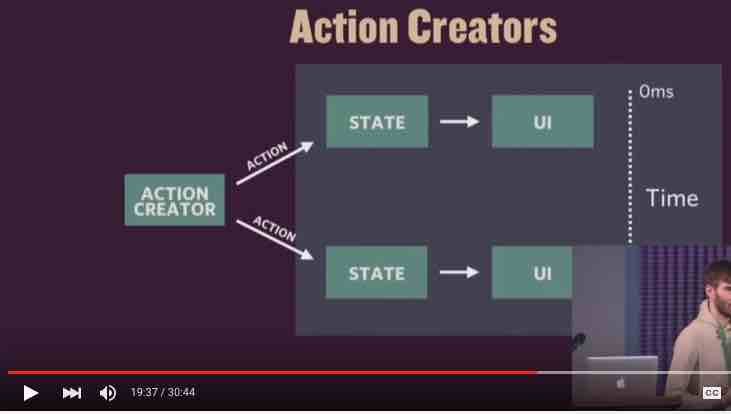
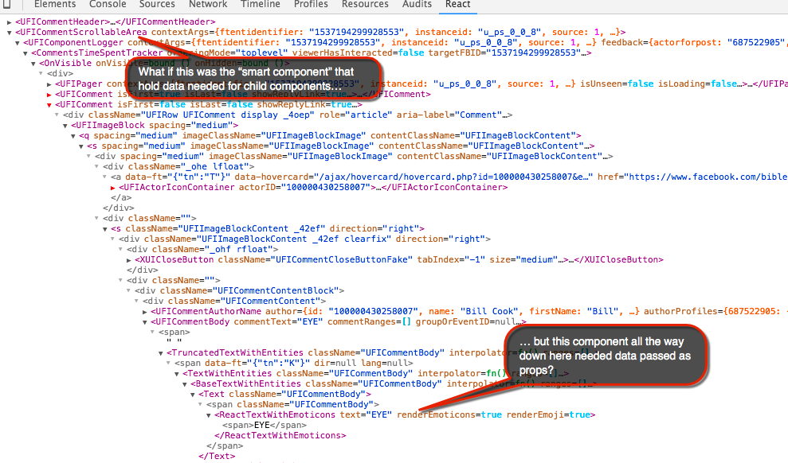
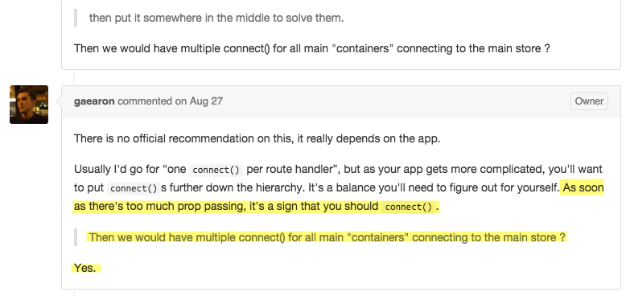

# Redux tips

In this chapter, I provide some commentary and additional resources for specific topics.  So far I address the following topics here:

* [Asynchronous actions (e.g., web requests)](#actions)
* [Thunk action guidance](#thunk-action-guidance)
* [Where to put **react-redux's `connect()`** calls?](#where-to-put-reactreduxs-connect-calls)

## Actions
Actions are a core concept of Redux.  Generally something in the UI will trigger an action.  "Reducers" will determine what to do to the app's state based on the action.  Per React's normal rendering paradigm, the UI will re-render when the state changes.

### Asynchronous actions (e.g., web requests)
Actions which should not execute synchronously require a slightly different approach.  This YouTube [video](https://youtu.be/764wvf8KuTw?t=1121) explains the concept.

This section of the video has a nice illustration of how action creators can fire a "start" and an "end" action.

This way the UI can respond to the fact that a web request is in progress (perhaps displaying a spinner).  Then when the "end" action fires, the UI can display new data.  The key idea here is that the UI only needed to dispatch one action (by an action creator) - and that action creator initiated the "start" and the "end" actions.

See the Redux docs for the full explanation about [async actions](http://rackt.org/redux/docs/advanced/AsyncActions.html).

### Thunk action guidance
If you read the Redux docs that talk about asynchronouse actions, you would have run into the description of the Thunk middleware.  It is what allows us to *dispatch*  other actions from an action creator.  

As the documentation explains, the Thunk middleware knows that it needs to intercept this special action type because it is a *function*, rather than a plain object.  Furthermore, when Thunk intercepts this function, it calls it, passing the `dispatcher` as the first argument, and optionally the `getState` method as the second argument to your function.

You might be wondering, why did Redux provide the ability to read from the global state in this special action creator?  As Dan Abramov explains in this [detailed Stack Overflow post](http://stackoverflow.com/a/35415559/718325), this allows you to, for example, check to see if an API call is really needed by checking to see if cached data is already stored.  So the point seems to be being able to prevent expensive side effects (such as calling an API).

In the Stack Overflow post linked above, he goes on to caution against abusing this access to `getState` from your action creator, saying, 
<blockquote>
"Don’t abuse this pattern. It is good for bailing out of API calls when there is cached data available, but it is not a very good foundation to build your business logic upon. If you use getState() only to conditionally dispatch different actions, consider putting the business logic into the reducers instead."
</blockquote>

## Where to put **react-redux's `connect()`** calls?

### First, what is **react-redux**?
[React-redux](https://github.com/rackt/react-redux) is a very small add-on library that makes it easy for React components to connect to Redux stores.  Connected React components receive new data automatically when the Redux store state changes.

Redux's docs explain how to setup this connection in its "[usage with React](http://rackt.org/redux/docs/basics/UsageWithReact.html)" section.

### Now, what's the problem?

In short, the challenge can be deciding which components should be `connect()`'d to the store.  But before I explain that, let's look at what might make this confusing.

#### Background to the problem

##### Issue #1: Why do we use Redux to decouple components?
One of the reasons to consider using a Flux implementation (such as Redux) backing up your React components is that it decouples your components. What does that mean?  

**Let's consider if we were not using Redux at all** - only using React's `props` to connect our components.  That would mean that if a nested component needed data, it would (usually, barring server-calls) need to receive it as `props` from a parent or grandparent component.  Furthermore, what if the nested component was nested deeply?

To supply the deeply nested component with the `prop` that it needs, the top component would have to pass a `prop` to its *direct child* component.  Then, that child would have to pass it to its direct child, which would in turn have to pass it to its direct child... until it would finally reach the lower component that needed it.  This is what it means for the components to be tightly coupled.  The can incur maintenance and portability problems.

##### Issue #2: What the Redux docs say in the 'Basics' tutorial.

In the Redux "basics" tutorial, under [usage with React](http://rackt.org/redux/docs/basics/UsageWithReact.html), it currently says (I added boldfacing for emphasis on a key sentence to discuss):

<blockquote>
...we wrap the components we want to connect to Redux with the connect() function from react-redux. <strong>Try to only do this for a top-level component, or route handlers</strong>. While technically you can connect() any component in your app to Redux store, avoid doing this too deeply, because it will make the data flow harder to trace.
</blockquote>

#### Do you spot the problem?
Now consider the 2 issues I outlined above.  What if only your top-level component is connected to the store and your components are deeply nested, like the above screenshot shows?  Bingo.  Then you're right back to having to pass that data down as props from one component to the next, all the way down your component tree.

### So how do we solve this?

The answer is easy:  you can `connect()` your lower-level components to the Redux store, just like you can higher-level components.  In fact, Dan Abramov, the creator of Redux [says elsewhere](https://github.com/rackt/react-redux/issues/75#issuecomment-135436563) that this is perfectly acceptable. Dan goes by the name "gaearon" on GitHub, where he replied to some questions about this:

