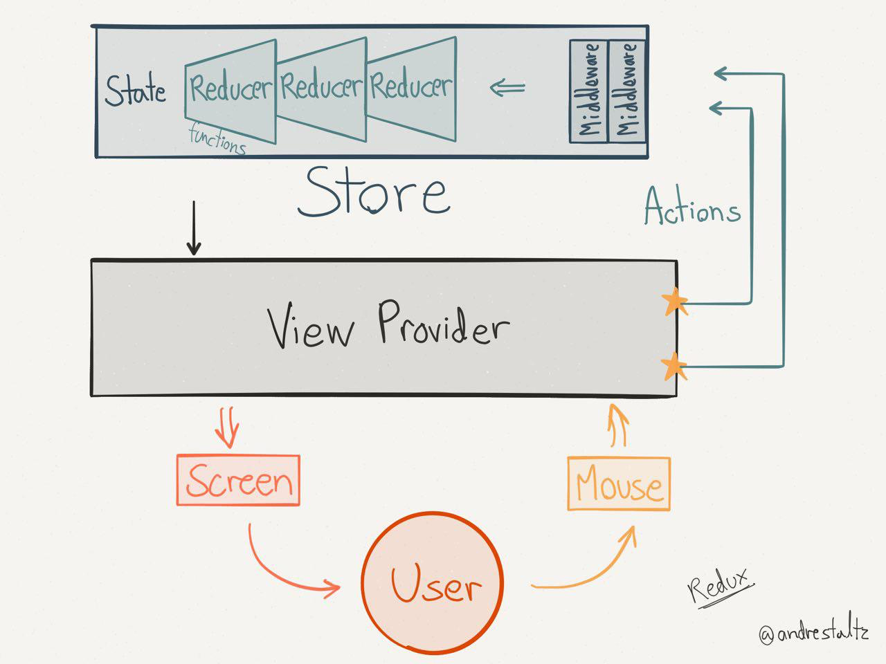

# Redux Introduction
Redux is the Flux implementation that we are using to tie our components together.  Flux is an architectural pattern that works especially well with React to handle data flow on the client.  

I think Redux is simpler to use than Facebook's Flux implementation. It also has the advantage of supporting **hot-reloading** and **"time travel"**.  More on those topics in a bit. 

In a nutshell, the main things to understand about Redux is that:
1. **It lets us avoid tightly coupling our React components**.  By using Redux, the React components don't need to know as much about each other when they can simply fire Redux "actions" and other React components can receive modified data from the Redux "store".  
2. Peices of your Redux code will usually **fetch and receive data from the server**. 

As an introduction, you can think of the data flow illustrated in the following diagram (**React** would be our "View Provider"):

