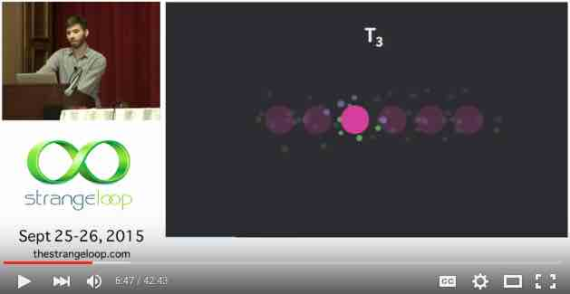
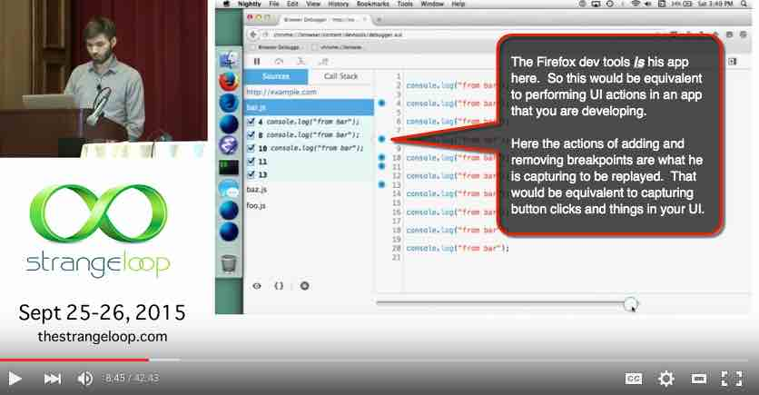

# Why Redux?
In this section I will discuss why we are using Redux.  I will also provide some resources which show these things in action.  **I recommend you watch/read these resources even if you just want to start learning concepts about Redux.**

As I reported elsewhere, using a Flux implementation like Redux **lets us avoid tightly coupling our React components**.  Additionally, the Flux pattern also works especially well with React to handle data flow on the client.  This is because Flux espouses a unidirectional data flow, just like React.  Thus Flux and React form a complete unidirectional data flow loop on the client.

##Why Redux specifically?

Redux's creator lists [several reasons](http://stackoverflow.com/a/32920459/718325), but to keep it simple here, I'll focus on two:
1. **Simplicity** (compared to Facebook's Flux). I think Redux is simpler to use than Facebook's Flux implementation.  And I'm not alone.  If you google around, you'll find many blog posts [reporting things like](http://jamesknelson.com/which-flux-implementation-should-i-use-with-react/#redux):

 >"Redux is by far the **simplest** of the frameworks I’ve discussed. It achieves this by making additional assumptions beyond those of Flux itself. Chief amongst these is the assumption that you never mutate your data. With this knowledge, you no longer need the Flux Dispatcher. It also makes it possible to describe changes to your data with plain old functions instead of a giant switch statement."

2. **Developer Experience**.  This is where the **hot-reloading** and **"time travel"** come into play.  These are major advancements in how we can develop and debug applications!  The architecture of React and Redux makes these features possible.  To see what these features are all about, see the resources below. 

## Resources 

1. [**Hot Reloading with Time Travel at react-europe 2015**](https://www.youtube.com/watch?v=xsSnOQynTHs). This video is a 30 minute talk by Dan Abramov – creator of the React Hot Loader and Redux.  This talk is primarily about the hot reloading and time-travel capabilities that these two technologies are capable of. However, you'll also begin to learn about programming concepts that are core to Redux, such as pure functions.  If nothing else, this video should get you pretty pumped up about this architecture!

 
   
 
2. [**Cleaning the Tar: Using React within the Firefox Developer Tools**](https://www.youtube.com/watch?v=qUlRpybs7_c) by James Long.  This video (~40 minutes) is a talk by James Long, a developer on the Firefox team at Mozilla.  What’s interesting about this video is that it is a completely different source (different from Dan Abromov talking about his products), but it corroborates the same architecture principles of React and Redux that make these new tools possible.  Like Dan’s talk, this one talks about React’s pure functions and such.  James also shows a completely different implementation of the “time travel” concept that Dan Abromov shows.  James’ implementation uses a UI slider to walk forward or backward in time.  If you only have time to watch one of these 2 videos, however, watch the first one by Dan Abramov.
 What is shown in this screenshot is a representation of an app's state at different points in time.  With React and Redux, you can step through these points in time simply by capturing the "actions".  

 I should point out one thing that confused me the first time I saw this video.  The speaker is using the Firefox dev tools for his demonstration... but what I didn't understand was that the dev tools *is* the UI in this case (not something that he's using to debug a different UI):
 
  