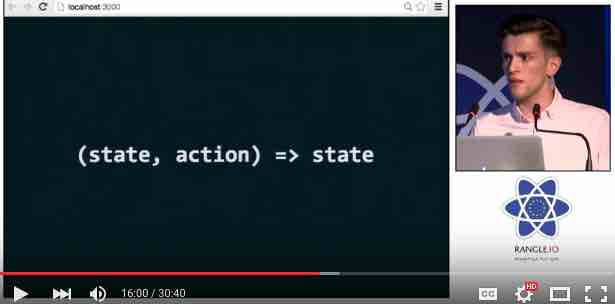

# Why Redux?

1. [**Hot Reloading with Time Travel at react-europe 2015**](https://www.youtube.com/watch?v=xsSnOQynTHs). This video is a 30 minute talk by Dan Abramov – creator of the React Hot Loader and Redux.  This talk is primarily about the hot reloading and time-travel capabilities that these two technologies are capable of. However, you'll also begin to learn about programming concepts that are core to Redux, such as pure functions.  If nothing else, this video should get you pretty pumped up about this architecture!

 
   
 
2. [**Cleaning the Tar: Using React within the Firefox Developer Tools**](https://www.youtube.com/watch?v=qUlRpybs7_c) by James Long.  This video (~40 minutes) is a talk by James Long, a developer on the Firefox team at Mozilla.  What’s interesting about this video is that it is a completely different source (different from Dan Abromov talking about his products), but it corroborates the same architecture principles of React and Redux that make these new tools possible.  Like Dan’s talk, this one talks about React’s pure functions and such.  James also shows a completely different implementation of the “time travel” concept that Dan Abromov shows.  James’ implementation uses a UI slider to walk forward or backward in time.  If you only have time to watch one of these 2 videos, however, watch the first one by Dan Abramov.
 What is shown in this screenshot is a representation of an app's state at different points in time.  With React and Redux, you can step through these points in time simply by capturing the "actions".  

 I should point out one thing that confused me the first time I saw this video.  The speaker is using the Firefox dev tools for his demonstration... but what I didn't understand was that the dev tools *is* the UI in this case (not something that he's using to debug a different UI):
 
  