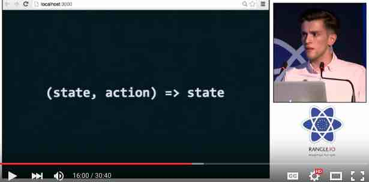
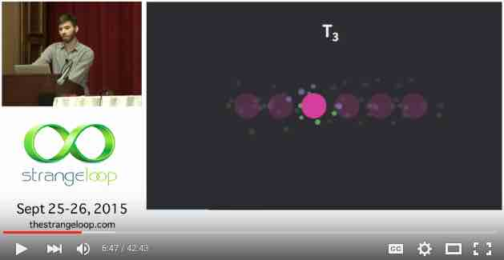
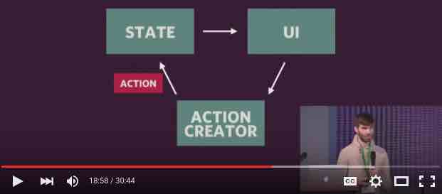
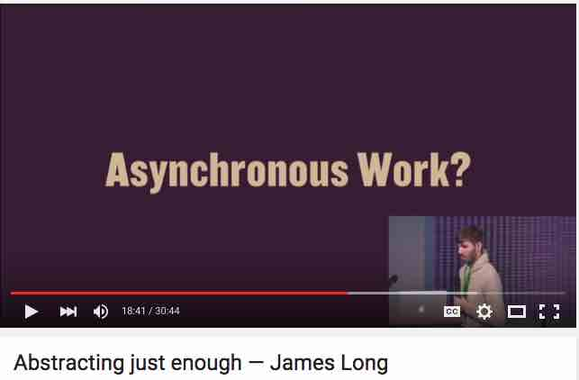

# Redux
Redux is the Flux implementation that we are using to tie our components together.  Using it is simpler than Facebook's Flux implementation. It also has the advantage of supporting **hot-reloading** and **"time travel"**.  More on those topics in a bit. 

## Main Resources
The best resources I've found so far are:
1. [**Hot Reloading with Time Travel at react-europe 2015**](https://www.youtube.com/watch?v=xsSnOQynTHs). This video is a 30 minute talk by Dan Abramov – creator of the React Hot Loader and Redux.  This talk is primarily about the hot reloading and time-travel capabilities that these two technologies are capable of. However, you'll also begin to learn about programming concepts that are core to Redux, such as pure functions.  If nothing else, this video should get you pretty pumped up about this architecture!

 
   
 
2. [**Cleaning the Tar: Using React within the Firefox Developer Tools**](https://www.youtube.com/watch?v=qUlRpybs7_c) by James Long.  This video (~40 minutes) is a talk by James Long, a developer on the Firefox team at Mozilla.  What’s interesting about this video is that it is a completely different source (different from Dan Abromov talking about his products), but it corroborates the same architecture principles of React and Redux that make these new tools possible.  Like Dan’s talk, this one talks about React’s pure functions and such.  James also shows a completely different implementation of the “time travel” concept that Dan Abromov shows.  James’ implementation uses a UI slider to walk forward or backward in time.  If you only have time to watch one of these 2 videos, however, watch the first one by Dan Abramov.
 What is shown in this screenshot is a representation of an app's state at different points in time.  With React and Redux, you can step through these points in time simply by capturing the "actions".  
 

3. Now for a resource that actually teaches you how Redux works and how to use it in an application.  [**Getting started with Redux**](https://egghead.io/series/getting-started-with-redux) is a video series of 30 short videos by Dan Abramov, creator of Redux.  In this series he explains both the concepts of Redux and how to implement the pieces.  It is very down to earth and easy to follow.  Along the way, he shows a few benefits of ES6 (but that’s not the focus).  If you only have a very limited amount of time, you could watch just the first 4 videos (totaling about 8 minutes) to get a sense of both what Redux is like and the quality of this resource.  

  

4. The [**official Redux documentation**](http://rackt.org/redux/index.html) is excellent. If nothing else, you should check out the [Basics section](http://rackt.org/redux/docs/basics/index.html), which is a good written counterpart to the 30-video series mentioned above (it creates a Todo app).
  

5. [**Immutable Data and React**](https://www.youtube.com/watch?v=I7IdS-PbEgI) from React.js Conf 2015.  As you'll learn in the other resources for Redux, immutability is a key component to Redux.  When we first presented Redux to our architecture team, they had questions about the **memory usage** and about **how the change-detection works**.  These are 2 key aspects of using immutable data.  

 

 This video shows:
     1. How **memory usage** can be efficient (via “structural sharing”)
     2. How **change-detection** becomes:
        1. very *easy* to check for (just comparing the reference of the “before” and “after”), and,
        2. extremely *fast* (O(1)). 
   
 
 Note that the *implementation* of immutability in this video uses the Immutable.js library – but that is just one way to go about this.  (Recall that Dan Abromav shows doing without that library in his Egghead videos.)  So the *implementation* that he shows is not the important part here – the 2 key aspects mentioned above are.  

 
 G2 Note: as of December 2015, we have not determined whether or not we will use the Immutable.js library.

   

## A note about the rest of this documentation
The official Redux documentation, plus other resources mentioned above, should be your go-to sources of learning.  I'm only including some extra notes below that I felt may help augment those other resources.  In other words, you should check out those resources before reading the rest of this one.

 

## Actions
Actions are a core concept of Redux.  Generally something in the UI will trigger an action.  "Reducers" will determine what to do to the app's state based on the action.  Per React's normal rendering paradigm, the UI will re-render when the state changes.

### Asynchronous actions (e.g., web requests)
Actions which should not execute synchronously require a slightly different approach.  This YouTube [video](https://youtu.be/764wvf8KuTw?t=1121) explains the concept.

This section of the video has a nice illustration of how action creators can fire a "start" and an "end" action.

This way the UI can respond to the fact that a web request is in progress (perhaps displaying a spinner).  Then when the "end" action fires, the UI can display new data.  The key idea here is that the UI only needed to dispatch one action (by an action creator) - and that action creator handled the "start" and the "end" action.

See the Redux docs for the full explanation about [async actions](http://rackt.org/redux/docs/advanced/AsyncActions.html).
